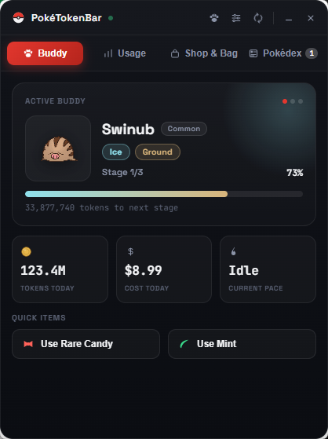
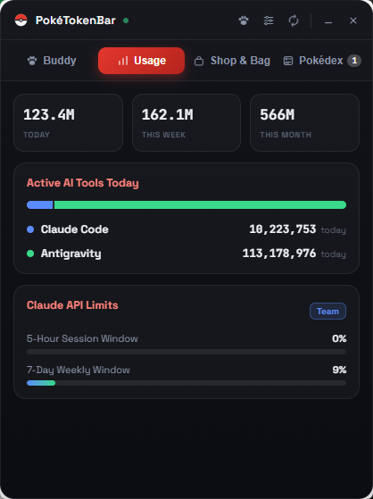
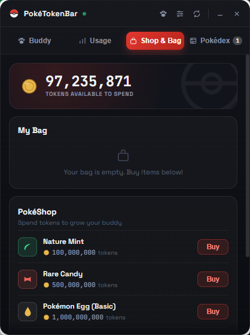
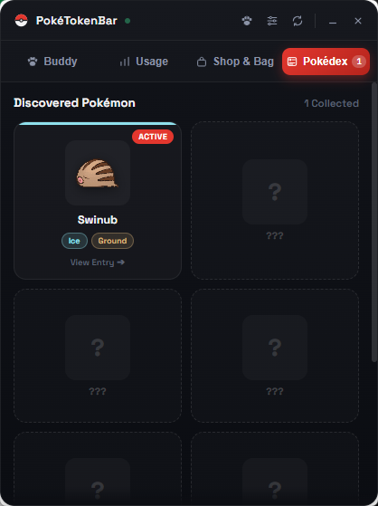
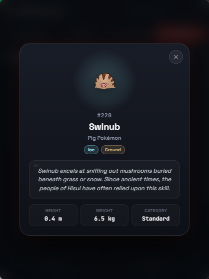
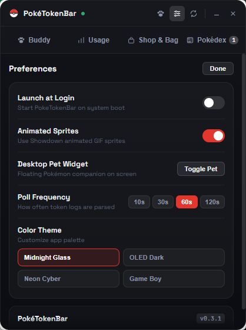
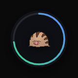

# PokeTokenBar (Linux / Windows port)

**Your AI coding tokens, hatched into Pokémon — now cross-platform.**

This project is a from-scratch cross-platform port of the original macOS menu-bar app [**chattymin/PokeTokenBar**](https://github.com/chattymin/PokeTokenBar) created by [**@chattymin**](https://github.com/chattymin). Re-engineered with **Tauri 2 (Rust backend + Svelte 5 frontend)**, it brings the AI-coding Pokémon companion experience to **Windows** and **Linux**.

It monitors the AI coding tokens you burn across 10 tools (Claude Code, Codex, Gemini CLI, Antigravity, OpenCode, Hermes Agent, Cursor, Grok CLI, Copilot CLI, Kiro CLI) and turns them into a growing, evolving Pokémon buddy right on your desktop.

> **Status: v0.3.6 — Trainer Passport, GitHub Activity Heatmap & PokéJournal (Linux & Windows).**
> - **10 Supported AI Providers**: Claude Code, Codex, Gemini CLI / AGY, Grok CLI, Antigravity, OpenCode, Hermes Agent, Cursor, Copilot CLI, Kiro CLI.
> - **🪪 Holographic Trainer Passport**: Custom Trainer ID (`#TR-XXXX`), customizable nickname, Pokédex buddy avatar selector, and career rank titles (`Novice` → `AI Grandmaster Champion`).
> - **🟩 GitHub-Style Token Coding Heatmap**: 26-week retroactive pixel contribution grid with 5 token intensity levels, current/best streak trackers, active day tallies, and daily average volume.
> - **📜 Trainer PokéJournal & Milestone Diary**: Auto-generated chronological timeline logging companion hatches, evolutions, graduations, berry feeding, and ribbon unlocks.
> - **⚡ Mega Evolution & Gigantamax Overdrive**: Temporary Mega / G-Max transformation during Fast/Blazing burn sprints with 2× Coin Rush shop multipliers and Prismatic HUD.
> - **🏅 Pokémon Ribbon & Achievement System**: 11 unique unlockable trainer ribbons & honors with an interactive Ribbon Case modal and Pokédex integration.
> - **🕹️ Desktop Pet 2.0**: Interactive petting animations (Happy Hop, Playful Wiggle, Floating Hearts), 15-minute Sleep & Wake cycle with floating `Zzz` bubbles, and Sitrus Berry golden sparkle aura.
> - **🎒 PokéShop & Bag Item Lore**: Comprehensive descriptions and live effect tiles for Rare Candies, Nature Mints, Oran Berries, Sitrus Berries, and Shiny Charms.
> - **Interactive Pokédex Detail Modal**: Click any discovered Pokémon to read its official game Pokédex lore, classification, height, weight, category, and earned ribbons.
> - **337 passing unit tests**. See [CHANGELOG.md](CHANGELOG.md), [docs/architecture.md](docs/architecture.md), and [docs/roadmap.md](docs/roadmap.md).

> [!IMPORTANT]
> **Provider Testing & Verification Status**:
> Live end-to-end testing has currently been verified with **Antigravity / `agy` (the new Gemini CLI)** and **Claude Code** (as these are the tools available in our testing environment).
>
> Parsers for all other 8 providers (Codex, Grok CLI, OpenCode, Hermes Agent, Cursor, Copilot CLI, Kiro CLI, legacy Gemini) are implemented and validated against the original Swift reference test suite fixtures (337+ unit tests), but **live testing from the community is actively welcome**! If you encounter any path or format differences, please open an issue on GitHub.

---

## 📸 App Preview & Gallery

<div align="center">

| 🐾 **Active Companion (Buddy)** | 📊 **Usage Analytics & AI Split** |
| :---: | :---: |
|  |  |

| 🎒 **Shop & Bag Economy** | 📖 **Pokédex Collection Grid** |
| :---: | :---: |
|  |  |

| 📜 **Pokédex Lore & Entry Modal** | ⚙️ **Preferences & Customization** |
| :---: | :---: |
|  |  |

<br/>

### 🐾 Floating Desktop Pet (Always-on-Top HUD)


*Interactive circular HUD with SVG perimeter progress ring, sleep cycle, and live burn pace indicators*

</div>

---

## 🌟 Key Features

### 🐾 1. Active Buddy & Evolution System
- **Egg Incubation to Final Mastery**: Burn AI tokens while coding to incubate eggs, hatch new Pokémon partners, and evolve them through multiple evolutionary stages.
- **Stage Pips & Type Badges**: Live stage tracker (`● ● ○`) and dynamic color themes matching Pokémon elemental types (Grass, Fire, Water, Electric, Ice, Ground, Psychic, Dragon, etc.).
- **Quick Action Items**: Use **Nature Mints** to reroll growth attributes, **Rare Candies** for instant progress, or **Oran & Sitrus Berries** to feed your companion directly from the Buddy card.
- **Celebration Banners**: Interactive banners with sparkle animations celebrating evolutionary milestones and Hall of Fame graduations.

### ⚡ 2. Mega Evolution & Gigantamax Overdrive
- **Burst Surge Mode**: When your burn rate hits the 🔥 *On Fire!* or ⚡ *Fast Pace* tier (e.g., deep agentic loops or subagent storms), your companion temporarily Mega Evolves or Gigantamaxes!
- **Dynamic Desktop HUD**: The floating pet widget ignites with glowing electric aura particle effects, a multi-color Prismatic progress ring, and custom Mega / G-Max sprite forms.
- **2× Coin Rush Multiplier**: Earn 2× Token Coins in the PokéShop while Overdrive mode is active (toggleable in Preferences).

### 🏅 3. Pokémon Ribbon & Achievement System
- **11 Unique Unlockable Ribbons**: Each Pokémon companion (both active buddy and graduated Pokédex entries) earns and preserves permanent honors:
  - 🐣 **Starter Ribbon**: Hatched from an egg to start your coding journey.
  - 💖 **Best Buddy Ribbon**: Petted & showed affection to your companion.
  - 🍊 **Gourmet Berry Ribbon**: Fed delicious Sitrus or Oran berries from the PokéShop.
  - ⚡ **Overdrive Surge Ribbon**: Sprang into Mega Overdrive during Fast / Blazing burn tiers.
  - 🌙 **Midnight Coder Ribbon**: Burned AI coding tokens late at night (00:00 – 05:00).
  - 🥉 **10M Burner Ribbon**: Burned over 10 Million AI tokens together.
  - 🥈 **50M Burner Ribbon**: Burned over 50 Million AI tokens together.
  - 🥇 **100M Century Ribbon**: Burned over 100 Million AI tokens together.
  - 👑 **500M Titan Ribbon**: Burned over 500 Million AI tokens together.
  - 🎓 **Hall of Fame Ribbon**: Reached final evolution and entered the Pokédex Hall of Fame.
  - ✨ **Star Sparkle Ribbon**: Exclusive mark awarded only to gleaming Shiny Pokémon.
- **Interactive Ribbon Case**: Click the ribbons bar on the Buddy card or in the Pokédex detail view to open a sleek trophy showcase.

### 🕹️ 4. Desktop Pet 2.0: Interactive Moods & Sleep Cycle
- **Always-on-Top Floating Sphere**: Transparent, frameless circular pet widget draggable anywhere on your desktop.
- **Click & Pet Interactions**: Click or tap your companion to trigger springy squash-and-stretch **Happy Hops**, playful **Tail/Body Wiggles**, or bursts of floating heart emojis (`❤️`, `💖`, `✨`, `🥰`, `⭐`).
- **Sleep & Wake Cycle**: Automatically curls up to sleep with floating `Zzz` bubbles and a gentle purple moon progress ring after 15 minutes of coding inactivity. Wakes up the moment you run an AI prompt!
- **Berry Feeding & Golden Aura**: Feed Sitrus Berries in the PokéShop to bestow a 1-hour glistening Golden Sparkle Aura (`✨`, `⭐`).

### 📊 5. Usage Analytics & Claude Rate Limits
- **Aggregated Summaries**: Real-time token consumption metrics for **Today**, **This Week**, and **This Month**, plus estimated cost in USD.
- **Active AI Tools Breakdown**: Proportional horizontal tool share bar and detailed per-provider breakdown lists.
- **Claude OAuth Rate Limit Tracking**: Direct integration with `~/.claude/.credentials.json` to monitor 5-hour session windows and 7-day weekly rate limits.

### 🎒 6. Shop & Bag Economy
- **Wallet Balance**: Tokens earned by coding become available currency to spend in the PokéShop.
- **Item Explanations & Lore**: Every item in the shop and bag features clear tooltips, lore descriptions, and live effect indicators.
- **Bag Inventory**: Store Nature Mints, Rare Candies, Oran Berries, Sitrus Berries, Shiny Charms, and Pokémon Eggs.
- **PokéShop**: Purchase Basic, Uncommon+, and Rare+ eggs, Mints, and Charms with interactive purchase animations and balance protection.

### 📖 7. Pokédex & Detailed Entry Dialog
- **Collection Tracker**: Browse all discovered Pokémon with primary type banners, active buddy tags, and animated Showdown GIFs.
- **Interactive Detail Modal**: Click on any discovered Pokémon to view its full Pokédex profile:
  - Official game description / lore flavor text.
  - Genus classification title (e.g. *Pig Pokémon*, *Seed Pokémon*).
  - Physical stats (Height in meters, Weight in kilograms).
  - Category (Standard, Legendary, Mythical).
  - Earned Ribbons and honors for that species.
- **Silhouette Progression**: Mystery locked slots (`?` / `???`) indicate remaining species to discover.

### 🎨 8. Theme Engine & Customization
- **4 Visual Themes**: *Midnight Glass*, *OLED Dark*, *Neon Cyber*, and *Game Boy Retro*.
- **Configurable Polling**: Adjust background token refresh frequency (10s, 30s, 60s, 120s, 300s).
- **Launch at Login**: Native autostart support on Windows (Registry) and Linux (XDG Autostart).
- **Animated Sprites Toggle**: Choose between animated Pokémon Showdown GIFs or static pixel art sprites.

---

## ⚡ Performance & Architecture

- **Rust Backend**: Fast, lightweight background daemon leveraging Tokio async runtime and Rusqlite.
- **Non-Blocking State Architecture**: Filesystem and WSL log scans run asynchronously in background tasks without holding the global application lock, ensuring the UI and floating pet never stall or freeze.
- **Disk Caching**: 30-day disk cache for the PokéAPI GraphQL species index and local sprite cache in `%LOCALAPPDATA%\poketokenbar\sprites` (Windows) or `~/.local/share/poketokenbar/sprites` (Linux) with zero external network requests during standard coding sessions.

---

## 📦 Building & Installation

### Prerequisites
- [Node.js](https://nodejs.org) (v18+)
- [Rust](https://rustup.rs) (1.78+)
- Platform build dependencies (Visual Studio C++ Build Tools on Windows, `libwebkit2gtk-4.1-dev` on Linux)

### Development
```bash
# Install frontend dependencies
npm install

# Run in development mode (hot reload)
npm run tauri dev
```

### Production Build
```bash
# Run TypeScript / Svelte checks
npm run check

# Build release binaries & installers
npm run tauri build
```
Installers will be generated under `src-tauri/target/release/bundle/`:
- **Windows**: `nsis/PokeTokenBar_0.3.5_x64-setup.exe` and `msi/PokeTokenBar_0.3.5_x64_en-US.msi`
- **Linux**: `deb/poketokenbar_0.3.5_amd64.deb` and `appimage/poketokenbar_0.3.5_amd64.AppImage`

---

## 🙏 Acknowledgements & Credits

- [**chattymin/PokeTokenBar**](https://github.com/chattymin/PokeTokenBar) by [**@chattymin**](https://github.com/chattymin): The original macOS app that inspired this port. Huge appreciation for the original game design, companion mechanics, and the comprehensive Swift reference test suite.
- [**PokéAPI**](https://pokeapi.co): Providing the public Pokémon species index, evolutionary chains, and types data.
- [**Pokémon Showdown**](https://play.pokemonshowdown.com): Animated battle sprites.

---

## ⚡ AI Vibe-Coding Disclaimer

> [!WARNING]
> **100% Vibe-Coded Project**:
> This entire cross-platform port, architecture, Rust backend, Svelte 5 frontend, and UI design was **completely vibe-coded** using:
> - **Gemini 3.7 Flash** (AGY / Antigravity)
> - **DeepSeek V4 Pro**
> - **Claude Design (Sonnet 5)**
>
> While backed by **336 passing unit tests** ported from the original Swift reference test suite with zero errors, **use at your own risk!** Bugs may be encountered, and contributions/PRs are always welcome.

---

## 📜 License & Disclaimer

This project is an **unofficial, non-commercial fan project**. It is not affiliated with, endorsed, sponsored, or approved by Nintendo, Game Freak, Creatures Inc., or The Pokémon Company. "Pokémon" and all related names, characters, and imagery are trademarks and copyrights of their respective owners.

No Pokémon assets are committed or bundled — species data and sprites are fetched at runtime from public APIs and cached locally.

The software is open source under the [MIT License](LICENSE).
